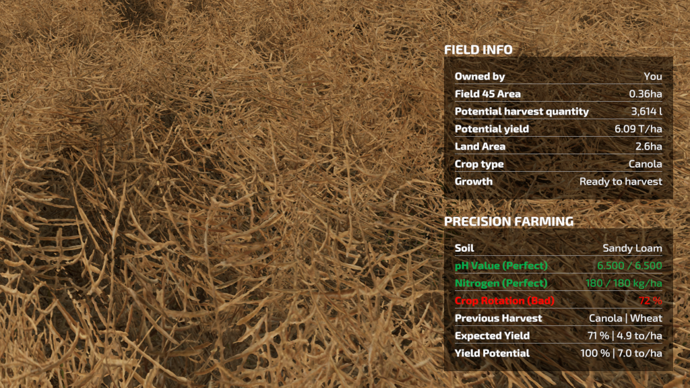

# FS22_CropRotation
*mod for Farming Simulator 22*

The Crop Rotation mod introduces incentive for growing different crops rather than planting potatoes over and over again.

Try yourself in reality, where nitrogen and lime are not the only nutrients that plants consume during their growth.

Gain up to 15% additional yield if you done it right.
Loose even more if you fail to take good care about the soil!

Key features:
- crop-specific return period to mitigate monoculture
- fallow support, up to two years (only with seasonal growth enabled)
- detailed in-game help menu
- in-game menu crop rotation planner

Future development:
- support for additional crops
- biomass content in soil management

## Crop Rotation

### General information

Planting the same crop every year (monoculture) leads to reduce in yield.

Depending on soil and crop type, the amount lost varies between 5 and 25 percent of expected yield. Different crops require different elements to take from the soil to grow.

Crop rotation is a technique to alternate types of plants with different requirements, which gives the soil time needed to supplement the missing one - usually contained in leftovers from previous harvests, but not yet in a form appropriate for plants to utilize.

Also lots of pests are adjusted to single kind of plants. Crop rotation severe their multiplication ability and soil is allowed to clean itself from pathogens specific to particular crop type.

Crop rotation performed well, prevents soil from loosing elements plants require for growth, and greatly reduce diseases and pests presence. All this leads directly to higher quality and quantity of yield in subsequent years.

### Return period

There is a minimal time that should be kept between planting the same type of crop on a given field, in order to prevent yield deduction due to pests and pathogens.

Canola, sunflower, potatoes and sugar beets can return in third planting season.

Most of cereals, soybean, sugar cane and cotton require at least one year gap.

Corn, grass and poplar can be grown every year, but farmer must take into account yield deduction due to soil nutrients depletion.

Example 1: Maize (monoculture, RP1)

| crop    | last year crop | previous year crop | return period | monoculture | result |
|-|-|-|-|-|-:|
| Maize    | Maize(ok, +0%) | Maize(ok, +0%)      | 1(ok, +0%)     | yes(-5%)    |    -5% |

Example 2: Grassland (monoculture, RP1)

| crop    | last year crop      | previous year crop | return period | monoculture | result |
|-|-|-|-|-|-:|
| Grass    | Grass(good, +10%)  | Grass(good, +5%)   | 1(ok, +0%)     | yes(-5%)    |  +10%  |

Example 3: Oat (monoculture, RP2)

| crop    | last year crop      | previous year crop | return period | monoculture | result |
|-|-|-|-|-|-:|
| Oat    | Oat(ok, +0%)  | Oat(ok, +0%)  | 2(bad, -5%)   | yes(-5%) |   -10% |

Example 4: Barley (monoculture, RP2)

| crop    | last year crop      | previous year crop | return period | monoculture | result |
|-|-|-|-|-|-:|
|Barley    | Barley(bad, -20%)  | Barley(bad, -10%)  | 2(bad, -5%)   | yes(-5%) |   -40% |

Example 5: Canola (monoculture, RP3)

| crop    | last year crop      | previous year crop | return period | monoculture | result |
|-|-|-|-|-|-:|
|Canola    | Canola(bad, -20%)  | Canola(bad, -10%)  | 3(bad, -15%)  | yes(-5%)    |   -50% |

### Forecrops

Some plants grow better or worse after certain forecrops. As a result, there are two lists maintained for each crop: list of good forecrops that provide yield bonus, and list of bad forecrops that reduce yield. Forecrops not listed in any of those, are neutral - they neither upgrade or degrade yield.

Cereals and oilseed grow very well after legumes (soybean). Rootcrops (sugarbeets) grow well after cereals. Sunflowers grow very well after sugar beets.

Avoid planting canola after sunflowers, sugarbeets after corn, or sunflowers after potatoes. The yield may be greatly reduced by choosing bad forecrops in rotation.

Two last crop categories have the dominant influence over current yield. The last forecrop gives 10% bonus to 20% loss, while previous year gives 5% bonus or 10% loss. Good crop rotation means keeping yields close to 100% of their potential.

You can manipulate crop order to get desired results.

Example 1: rotation Barley -> Soybean -> Canola

| crop    | last year crop      | previous year crop  | result |
|-|-|-|-:|
| Barley  | Canola(good, +10%)  | Soybean(good, +5%)  |   +15% |
| Soybean | Barley(ok, +0%)     | Canola(good, +5%)   |    +5% |
| Canola  | Soybean(good, +10%) | Barley(good, +5%)   |   +15% |

Example 2: rotation Potatoes -> Barley -> Canola

| crop    | last year crop      | previous year crop | result |
|-|-|-|-:|
| Potatoes  | Canola(good, +10%) | Barley(ok, +0%)    |   +10% |
| Barley    | Potatoes(ok, +0%)  | Canola(good, +5%)  |    +5% |
| Canola    | Barley(good, +10%) | Potatoes(ok, +0%)  |   +10% |

Example 3: rotation Barley -> Canola

| crop    | last year crop      | previous year crop | return period | result |
|-|-|-|-|-:|
| Barley    | Canola(good, +10%) | Barley(bad, -10%)  | 2(ok, +0%) | +10% |
| Canola    | Barley(good, +10%) | Canola(bad, -10%)  | 3(bad, -5%) | +10% |

Example 4: rotation Potato -> Canola -> Sunflower

| crop      | last year crop     | previous year crop   | result |
|-|-|-|-:|
| Potato    | Sunflower(ok, +0%) | Canola(good, +5%)    |    +5% |
| Canola    | Potato(ok, +0%)    | Sunflower(bad, -10%) |   -10% |
| Sunflower | Canola(bad, -20%)  | Potato(bad, -10%)    |   -30% |

### Fallow

You may also leave field without planting for full year (fallow). Soil will then regain the ability to support even the most demanding crops.

Example 1: (medieval three-field) Wheat -> Wheat -> Fallow

| crop   | last year crop     | previous year crop | return period | result |
|-|-|-|-|-:|
| Wheat  | Fallow(good, +10%) | Wheat(bad, -10%)   | 2(ok, +0%)     |    +0% |
| Wheat  | Wheat(bad, -20%)   | Fallow(good, +5%)  | 2(bad, -5%)   |    -5% |
| Fallow | Wheat              | Wheat              | --            |   --   |

Fun fact: the third-on wheat yield would've been reduced by 40% if not replaced by fallow.

To trigger fallow one must: harvest the yield, and do not perform sowing until full year has passed. For example: if harvest was in August 2022, then next agricultural year starts in March 2023. Do not sow until March 2024 to achieve fallow bonus.

### Crop Rotation Field Info Box

In field info box, there is additional entry, with crop rotation efficiency and two last harvested crop categories.
Crop rotation efficiency is the percentage of gain (or lost) yield.

Perfect crop rotation allows to receive additional 15 percent of yield.

Ignoring crop rotation may reduce yield by 50 percent.

#### Precision Farming

In case precision farming mod is in use, the crop rotation efficiency becomes one of the ingredients of the final yield estimation, added to precision farming info box.

Crop rotation efficiency is now a part of yield potential, next to nitrogen, pH, soil type, seed rate and weeds coefficients.

### Crop Rotation Data

At this moment, all data is static, means it is not possible to load additional mods that override parameters defined locally. However preparations have been made to allow such flexibility in the future.

Curious ones may check data/crops.xml file for details - all crop rotation information is load from there.

In case you prefer picture over xml text (I'm not judging!), here you have some nice screenshots from my spreadsheet.

### Contributing

Please make pull request with changes to translations, if you want to add some language or improve existing one. Remember to add your name inside `translationContributors` tag.

If you have some idea how could I improve the mod, please contact me via GIANTS forum, nick bodzio528. I am open to suggestions.
